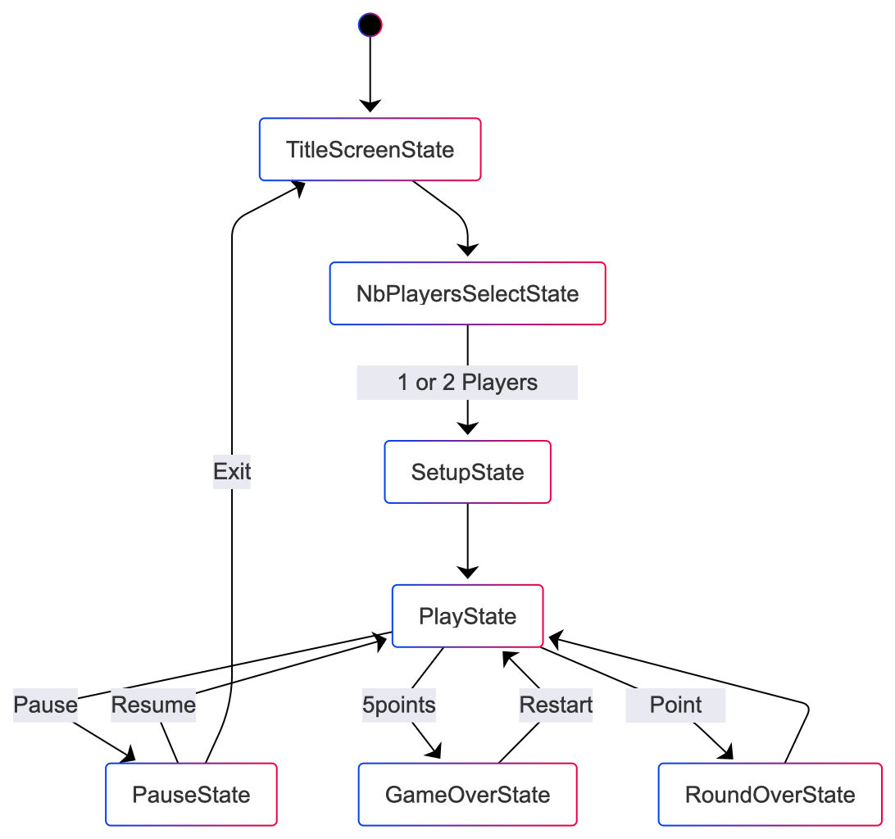
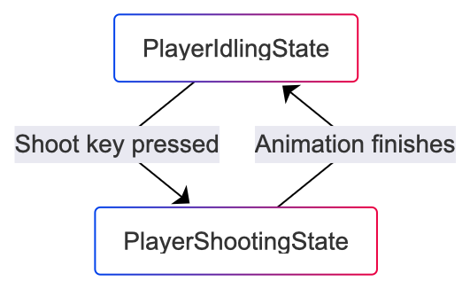
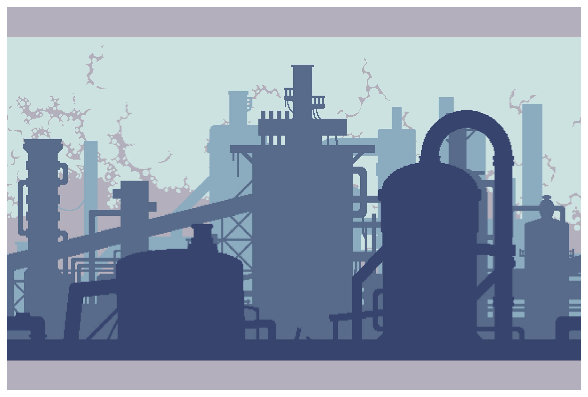
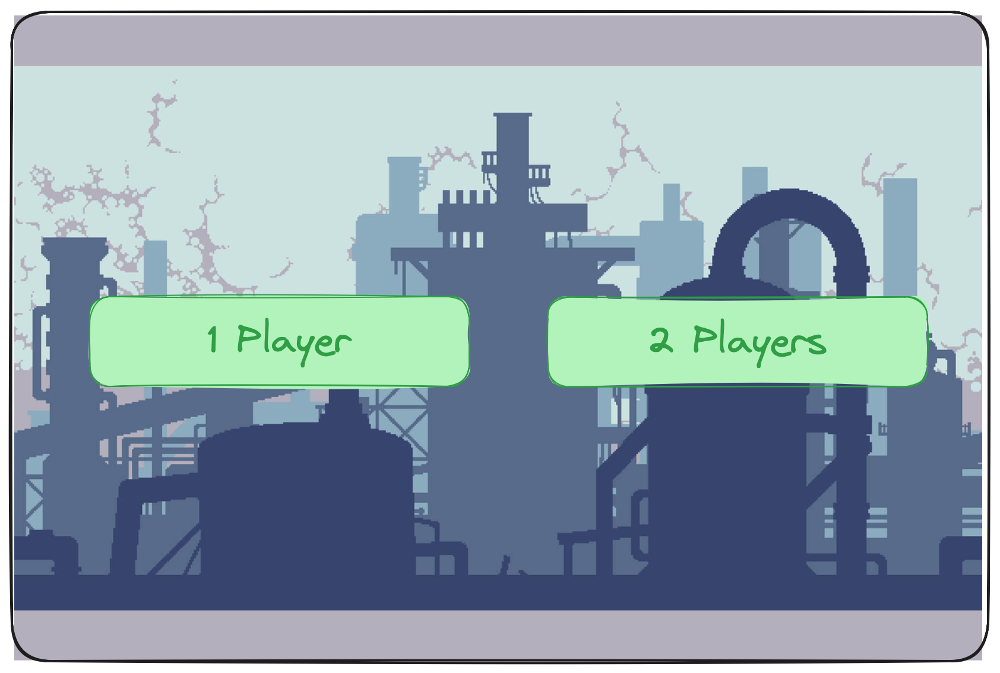
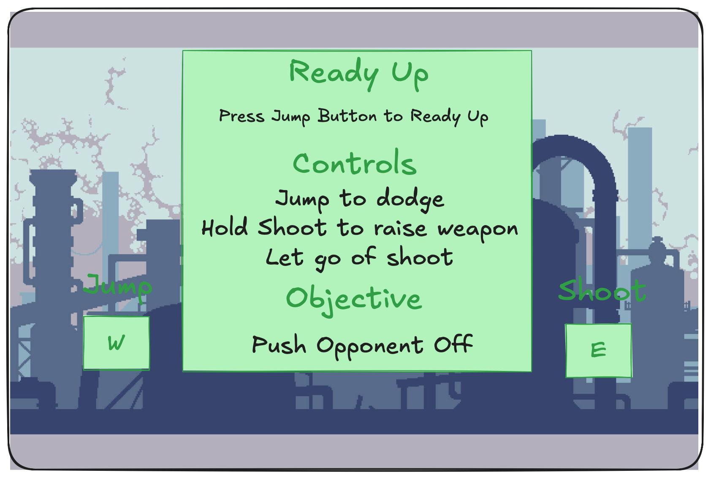
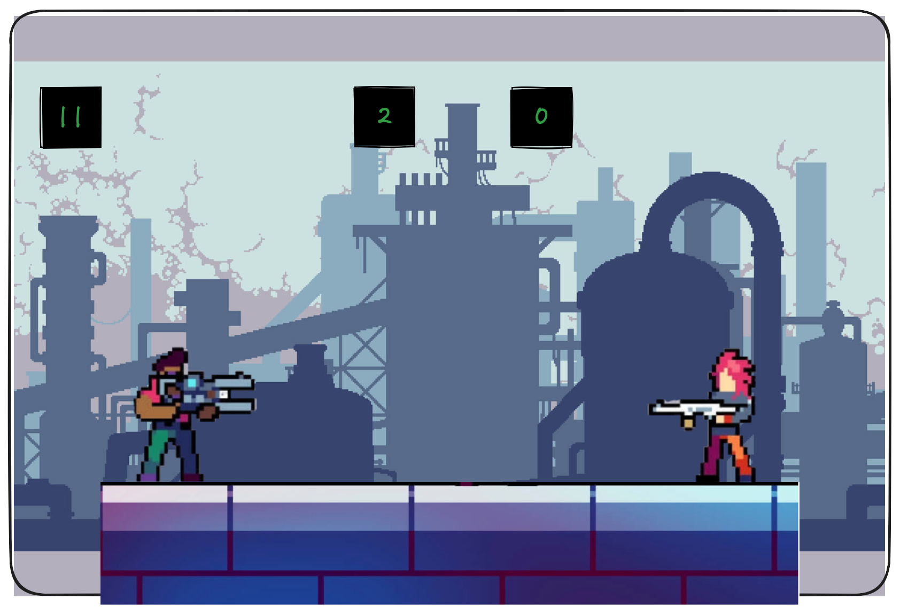
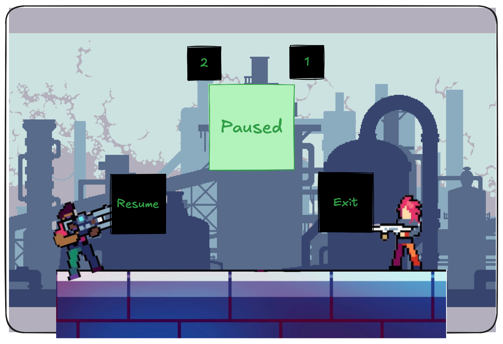
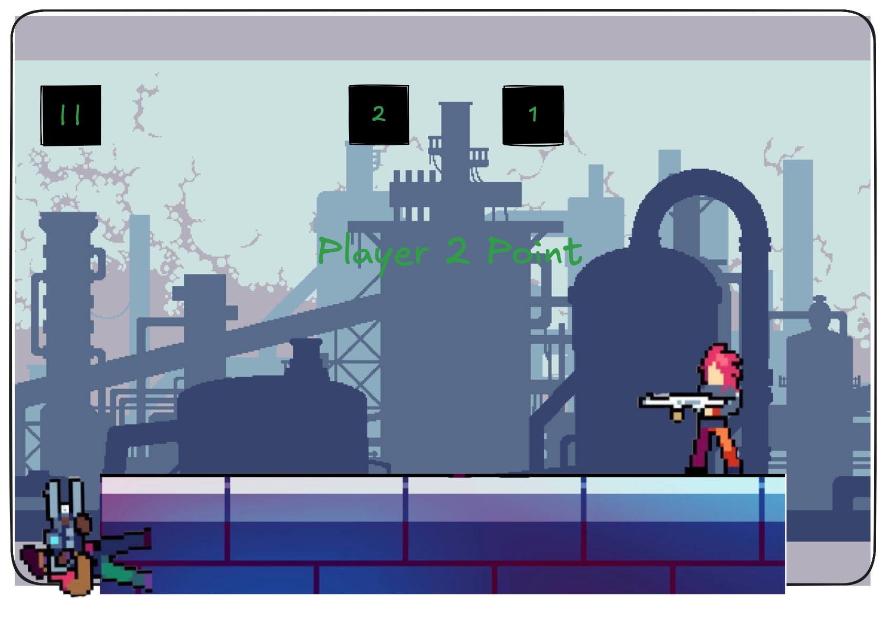
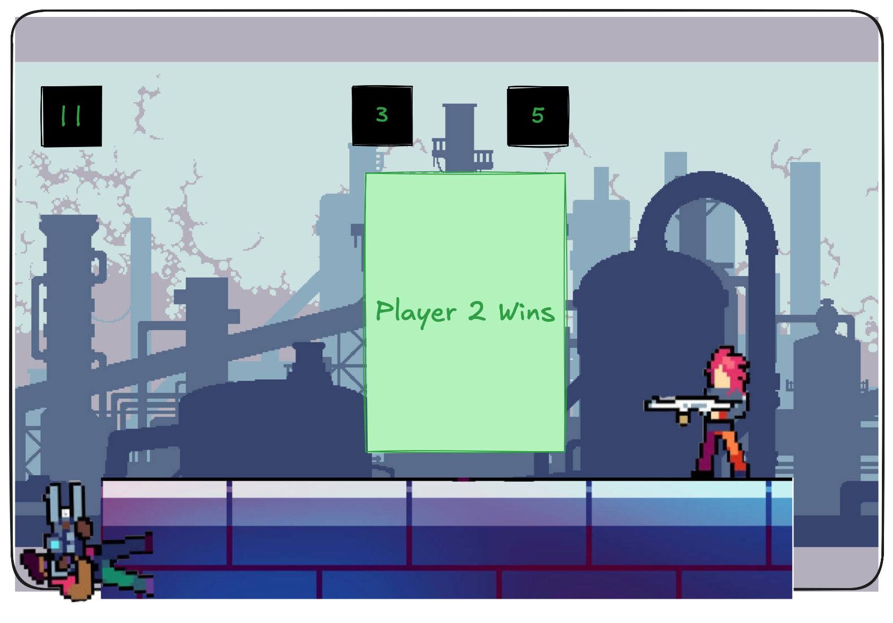

notes from feedback
wants classes with inheritence and polymorphism + factory
weapon, bullet, power ups?, objects

persistence
localStorage, when you hit refresh you must get back to exactly where you were

juice
particles from weapon, bullets, power ups + tweens between title screens

class diagram
dont mention sprites, states, tweens/animations, simply mention what is specific of your codebase

# Final Project

-   [X] Read the [project requirements](https://vikramsinghmtl.github.io/420-5P6-Game-Programming/project/requirements).
-   [X] Replace the sample proposal below with the one for your game idea.
-   [ ] Get the proposal greenlit by Vik.
-   [ ] Place any assets in `assets/` and remember to update `src/config.json`.
-   [ ] Decide on a height and width inside `src/globals.js`. The height and width will most likely be determined based on the size of the assets you find.
-   [ ] Start building the individual components of your game, constantly referring to the proposal you wrote to keep yourself on track.
-   [ ] Good luck, you got this!

---

# Platforn Shooters

> [!note]
> This was taken from a project I did in university so the scope is **much** larger than what I'm expecting from you in terms of number of features!

## ✒️ Description

In this 2d platform game, 2 players are positioned on a rooftop with the purpose of knocking the other player off of the platform. Players have access to a random weapon every game (both players get the same random weapon). Similarly, random obstacles are generated every round in order to spice the interactions up, whether it is a beach ball (very bounce) or a brick wall (intercepts projectiles). The game is over when a player is knocked out of a rooftop 5 times. 

## 🕹️ Gameplay

Each round start with each player positioned on an extremity of the roof. Players can not walk, instead they are constantly rocking back and forth and need to time their jump in order to go in the direction they want. The weapon mechanic is also unconventional, in order to aim, players need to raise their arm and let go of the trigger when they think the weapon is oriented at the proper angle in order to hit the other player. All weapons are ranged and have different aspects.

* Bazooka: The projectile coming out of the weapon  has a travel time and is heavier, allowing for more knocking out potential on hit. (If spare time at the end, projectile could have a shockwave that ejects the enemy if they are close enough to where it exploded)

* Handgun: project has no travel time, instant hit but lower weight with less knocking out potential.

* Lazer: Shoots a lazer beem for a second, relatively high knocking out potential.

* Axe throwing: Very short range, but projectile loses speed very quickly, players need to get close to each others for max effect.

If players get close enough to each others, they could use their own body to push the other player off of the roof.

# 📃 Requirements – Platform Shooters

1. The system shall load all assets before starting the game.  
2. The system shall allow the player to start a new match from the main menu.  
3. The system shall randomly select a weapon for the match.  
4. The system shall assign the same random weapon to both players.  
5. The system shall randomly generate 0–2 obstacles at the start of each round.  
6. The system shall place Player 1 and Player 2 on opposite sides of the rooftop at the start of each round.  
7. Players shall not be able to walk; they shall rock forward and backward automatically.  
8. Players shall move horizontally by jumping while rocking.  
9. The player shall be able to enter an aiming state by holding the shoot button.  
10. While aiming, the system shall raise the player’s arm over time.  
11. The projectile shall fire when the shoot button is released.  
12. Each weapon shall use its own behavior:  
    - Bazooka: slow, heavy projectile with high knockback  
    - Handgun: instant hit scan with low knockback  
    - AK47: fires 3 bullets in a spread  
    - Axe: short-range projectile that slows quickly  
13. The system shall apply knockback when a projectile hits a player.  
14. Knockback strength shall depend on the weapon used.  
15. The system shall detect collisions between projectiles and players, obstacles, and boundaries.  
16. The system shall destroy projectiles upon collision.  
17. The system shall spawn random obstacles such as beach balls or brick walls.  
18. Obstacles shall have physics behaviors (bounce, block bullets, etc.).  
19. The system shall regenerate new obstacles each round.  
20. A player shall lose a round when they fall off the rooftop.  
21. The opponent’s score shall increase by 1 when this occurs.  
22. The system shall reset players, weapons, and obstacles at the start of a new round.  
23. The match shall end when one player reaches 5 knockouts.  
24. The system shall display a winner screen when the match ends.  
25. The system shall restart the match when the player chooses “Play Again.”  
26. The system shall return to the main menu when “Exit” is selected.  

### State Diagram

### Player State Diagram

### 🗺️ Class Diagram

### 🧵 Wireframes
THe following is a pretty rough decison. The main text is there but the color scheme and fonts are not. We will have some tweening in the navigations between most screens.

-   _Start Game_ will navigate to the select number of players screen.

-   _1 Player_ will navigate to the Setup Screen with 1 player selected
-   _2 Players_ will navigate to the Setup Screen with 2 players selected

-   _jump w_ will navigate to the Play Screen. The player must click on the jump button to go to the play screen. If the player chose 2 Players then we will see both Jump and Shoot for both players and both players must press the Jump button.

-   The main gameplay in here, players will have their weapons down initially and will be leaning back and forth. They can jump or shoot. We see the score up there.
- _Pause_ (at top right in later screens) will navigate to the Pause State. No tweening in this navigation. 

-   _Resume_ will navigate back to the Play Screen keeping the current location of players and score. No tween in this navigation.
- _Exit_ will navigate to the TitleScreen.

- When a player falls off he will be stopped at the edge of the screen. The text will be animated into the view and the score will be updated. The text will be on a panel, not just plain text.

- When a player reachers 5 points the game ends and we see which player won. Pretty Straightforward. There will be a button to exit and a button to restart game similar to the Pause Screen which will navigate you back to the Setup Screen.

### 🎨 Assets

We used [excalidraw](https://excalidraw.com) to create the wireframes.

We plan on following trends already found in other similar friv games. The GUI will be kept simple and playful, as to make sure the game is easy to understand and play.

#### 🖼️ Images

Most images will be used from the following tilesets:

- [Characters](https://craftpix.net/freebies/free-guns-pack-2-for-main-characters-pixel-art/)
- [Map](https://craftpix.net/freebies/free-industrial-zone-tileset-pixel-art/)

#### ✏️ Fonts

fonts gonna come from the tileset downloaded

For fonts, a simple sans-serif like Roboto will look quite nice. It's a font that is legible, light on storage size, and fun to keep with the theme we're going for. We also used a more futuristic font for the title screen, so we will be using the font that is provided in the tileset.

-   [Titles Font](https://www.dafont.com/futuremillennium.font)
-   [Roboto](https://fonts.google.com/specimen/Roboto)

#### 🔊 Sounds

All sounds were taken from [101soundboards.com](https://www.101soundboards.com/sounds/) for the actions and effects.

-   [Bazooka Sound effect](https://www.101soundboards.com/sounds/1531023-bazooka)

### 📚 Physics Engine

We wish to use **matter.js** as our phyics engine for this project similarly to angry birds. As shown in the class diagram, most things are Rectangles or Circles
