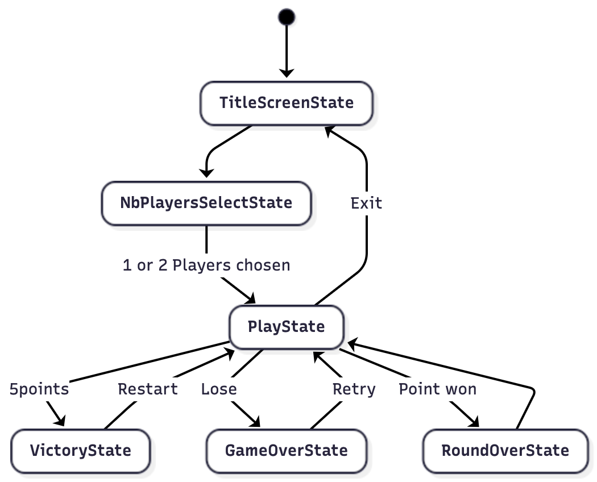
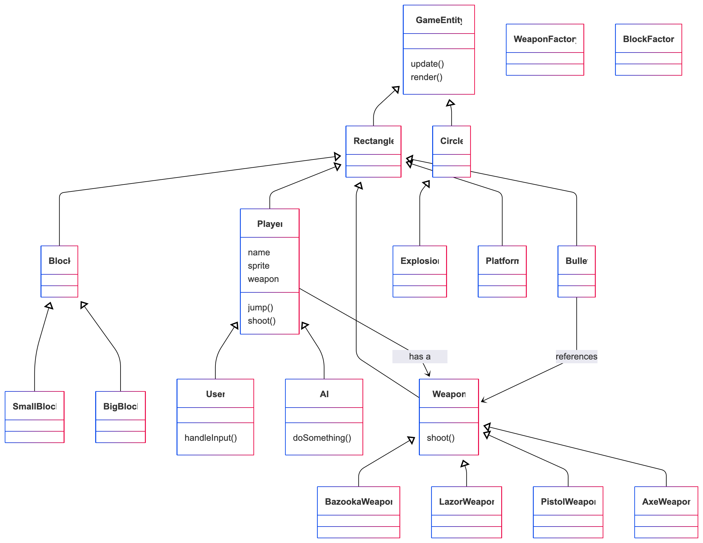

# Final Project

-   [ ] Read the [project requirements](https://vikramsinghmtl.github.io/420-5P6-Game-Programming/project/requirements).
-   [ ] Replace the sample proposal below with the one for your game idea.
-   [ ] Get the proposal greenlit by Vik.
-   [ ] Place any assets in `assets/` and remember to update `src/config.json`.
-   [ ] Decide on a height and width inside `src/globals.js`. The height and width will most likely be determined based on the size of the assets you find.
-   [ ] Start building the individual components of your game, constantly referring to the proposal you wrote to keep yourself on track.
-   [ ] Good luck, you got this!

---

# Sample Proposal - Random Shooters

> [!note]
> This was taken from a project I did in university so the scope is **much** larger than what I'm expecting from you in terms of number of features!

## ✒️ Description

In this 2d platform game, 2 players are positioned on a rooftop with the purpose of knocking the other player off of the platform. Players have access to a random weapon every game (both players get the same random weapon). Similarly, random obstacles are generated every round in order to spice the interactions up, whether it is a beach ball (very bounce) or a brick wall (intercepts projectiles). The game is over when a player is knocked out of a rooftop 5 times. 

## 🕹️ Gameplay

Each round start with each player positioned on an extremity of the roof. Players can not walk, instead they are constantly rocking back and forth and need to time their jump in order to go in the direction they want. The weapon mechanic is also unconventional, in order to aim, players need to raise their arm and let go of the trigger when they think the weapon is oriented at the proper angle in order to hit the other player. All weapons are ranged and have different aspects.
* Bazooka: The projectile coming out of the weapon  has a travel time and is heavier, allowing for more knocking out potential on hit. (If spare time at the end, projectile could have a shockwave that ejects the enemy if they are close enough to where it exploded)

* Handgun: project has no travel time, instant hit but lower weight with less knocking out potential.

* AK47: Shoots a wave of 3 bullets on release, bullets have a travel time (low), relatively high knocking out potential.

* Axe throwing: Very short range, but projectile loses speed very quickly, players need to get close to each others for max effect.

If players get close enough to each others, they could use their own body to push the other player off of the roof.

# 📃 Requirements – Random Shooters

1. The system shall load all assets before starting the game.  
2. The system shall allow the player to start a new match from the main menu.  
3. The system shall randomly select a weapon for the match.  
4. The system shall assign the same random weapon to both players.  
5. The system shall randomly generate 0–2 obstacles at the start of each round.  
6. The system shall place Player 1 and Player 2 on opposite sides of the rooftop at the start of each round.  
7. Players shall not be able to walk; they shall rock forward and backward automatically.  
8. Players shall move horizontally by jumping while rocking.  
9. The player shall be able to enter an aiming state by holding the shoot button.  
10. While aiming, the system shall raise the player’s arm over time.  
11. The projectile shall fire when the shoot button is released.  
12. Each weapon shall use its own behavior:  
    - Bazooka: slow, heavy projectile with high knockback  
    - Handgun: instant hit scan with low knockback  
    - AK47: fires 3 bullets in a spread  
    - Axe: short-range projectile that slows quickly  
13. The system shall apply knockback when a projectile hits a player.  
14. Knockback strength shall depend on the weapon used.  
15. The system shall detect collisions between projectiles and players, obstacles, and boundaries.  
16. The system shall destroy projectiles upon collision.  
17. The system shall spawn random obstacles such as beach balls or brick walls.  
18. Obstacles shall have physics behaviors (bounce, block bullets, etc.).  
19. The system shall regenerate new obstacles each round.  
20. A player shall lose a round when they fall off the rooftop.  
21. The opponent’s score shall increase by 1 when this occurs.  
22. The system shall reset players, weapons, and obstacles at the start of a new round.  
23. The match shall end when one player reaches 5 knockouts.  
24. The system shall display a winner screen when the match ends.  
25. The system shall restart the match when the player chooses “Play Again.”  
26. The system shall return to the main menu when “Exit” is selected.  

### 🤖 State Diagram

> [!note]
> Remember that you'll need diagrams for not only game states but entity states as well.

### 🗺️ Class Diagram

### 🧵 Wireframes

> [!note]
> Your wireframes don't have to be super polished. They can even be black/white and hand drawn. I'm just looking for a rough idea about what you're visualizing.

-   _Let's Play_ will navigate to the main game.
-   _Upload Cards_ will navigation to the forms for uploading and parsing the data files for the game.
-   _Change Log_ will navigate the user to a page with a list of features/changes that have been implemented throbughout the development of the game.

We want to keep the GUI as simple and clear as possible by having cards with relevant images to act as a way for the user to intuitively navigate the game. We want to implement a layout that would look like as if one were playing a match of the Pokémon Trading Card Game with physical cards in real life. Clicking on any of the cards will reveal that card's details to the player.

### 🎨 Assets

We used [app.diagrams.net](https://app.diagrams.net/) to create the wireframes. Wireframes are the equivalent to the skeleton of a web app since they are used to describe the functionality of the product and the users experience.

We plan on following trends already found in other trading card video games, such as Pokémon Trading Card Game Online, Hearthstone, Magic the Gathering Arena, and Gwent.

The GUI will be kept simple and playful, as to make sure the game is easy to understand what each component does and is, as well as light hearted to keep to the Pokémon theme.

#### 🖼️ Images

-   Most images will be used from the well known community driven wikipedia site, [Bulbapedia](https://bulbapedia.bulbagarden.net/wiki/Main_Page).
-   Especially their [Trading Card Game section](<https://bulbapedia.bulbagarden.net/wiki/Full_Art_card_(TCG)>).

#### ✏️ Fonts

For fonts, a simple sans-serif like Roboto will look quite nice. It's a font that is legible, light on storage size, and fun to keep with the theme we're going for. We also used a more cartoonish Pokemon font for the title screen.

-   [Pokemon](https://www.dafont.com/pokemon.font)
-   [Roboto](https://fonts.google.com/specimen/Roboto)

#### 🔊 Sounds

All sounds were taken from [freesound.org](https://freesound.org) for the actions pertaining to cards.

-   [Shuffle cards](https://freesound.org/people/VKProduktion/sounds/217502/)
-   [Flip card](https://freesound.org/people/Splashdust/sounds/84322/)

### 📚 References

-   [Pokemon Rulebook](http://assets.pokemon.com/assets/cms2/pdf/trading-card-game/rulebook/xy8-rulebook-en.pdf)
